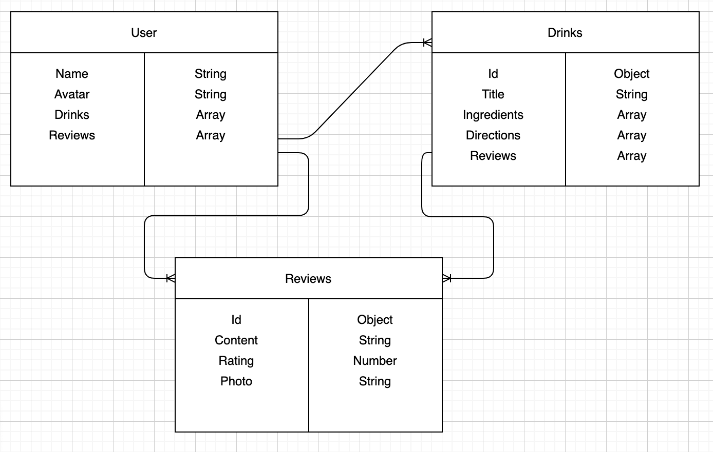

# README:

- The BYOB app is designed to let users share and review their favorite cocktail/mocktail recipes
- Drinks can be well-known, or user-created
- Users can log-in via Google/Gmail
- Users will be able to:
  - Submit recipes
  - Update and delete their submit recipes
  - Review and rate recipes
  - View all recipes submit by other users

### From every page

- Each page will have links to get to
  - All Drinks
  - Add Drink
  - My Drinks

### “All Drinks” page

- The “All Drinks” page will have a list of all the drinks by all users
- Each drink will have a “details” link

### Drink’s "ID" Page

- A drink’s id page will include the full recipe, instructions, and reviews
- The reviews will be submit to the page from a form

### “Add Drink” page

- The “Add Drink” page will have a form to complete with different sections
- Ingredients
  - Should the user choose to include them, the ingredients should also be added with measurements
- Instructions
- Title of the drink
- Drinks submit do not have to be drinks known to everyone, they can be something entirely made up (just be ready to be judged in the reviews if it’s bad).
- Drinks are not “published” until user clicks the “Submit” button

### “My Drinks” page

- A user’s “my drinks” page will contain a list of the drinks they’ve submit
- Each of their drinks will have links to delete, update, or view that particular drink

### Reviews

- Reviews should have a rating scale (1-5), include a description of why it is rated that way, and a photo from those who are rating it (photo will not be required)

### Log-In Page

- The title page will include a space to log-in via Google to access your personal BYOB account

### Future goals:

- Cocktail / Mocktail toggle
  - If mocktail is selected in “add drink” it will populate on the drink’s main descriptor, so when users are viewing drinks, they can spot out the mocktails instead of clicking on them
- Search recipes with a keyword
- Show recipe rating on “All Drinks” screen in container

## Wireframes

### Title Page

### All Drinks Page

### Add Drink Page

### Drink's "ID" Page

### "My Drinks" Page

## ERD

